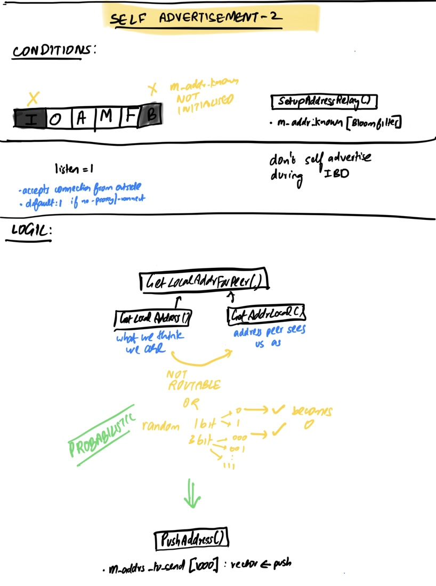

# self advertisement

## concept
`2022-11-24T09:42:23Z [net] Advertising address dummy-ip-address to peer=33`
- we advertise our ip address to other nodes so that they can reach us.

## need
- if we initiate an outbound connection to a peer, peer wouldn't know how to reach us
- so we tell the peer how to reach us by announcing our address
- sometimes we end up announcing our address even when we are unreachable
	- e.g. if we're behind a NAT, or the port for bitcoin is blocked by our firewall
	- if we don't accept inbound connections, we can set listen=0 to not self advertise our address
  
## method

Self advertisement is done in 2 areas of the codebase with slightly different logic. See [PR 26199](https://github.com/bitcoin/bitcoin/pull/26199).

### 1. self advertisement during version processing mechanism (will disappear if #26199 gets merged)

- see [link](https://github.com/bitcoin/bitcoin/blob/bdcafb913398f0cdaff9c880618f9ebfc85c7693/src/net_processing.cpp#L3278-L3307)
- `ThreadMessageHandler()` -> `ProcessMessages()` -> `ProcessMessage()` 

### 2. self advertisement during `MaybeSendAddr` mechanism

- see [link](https://github.com/bitcoin/bitcoin/blob/bdcafb913398f0cdaff9c880618f9ebfc85c7693/src/net_processing.cpp#L5077-L5094)
- `ThreadMessageHandler()` -> `SendMessages()` -> `MaybeSendAddr()`

### 3. Behaviour before #26199
1. `[not necessary]`: two self-ads in one ADDR message (one added in version processing, one added in MaybeSendAddr if they are different).
   - ex: if we discovered a local IPv6 address and our peer sees us under a IPv4 address
   - not necessary because  [nScore](https://github.com/bitcoin/bitcoin/blob/f59e91511a3aa8b2770eeec7034ddc1a9dec918b/src/net.cpp#L245) logic tells us which address is better.
2. `[hypothetical/doesn't happen]`: time between the two calls
   - self-ad in version processing => has correct metadata like nTime
   - self-ad in MaybeSendAddr => someone could insert wrong metadata => this self-ad would be dismissed(because we just look up the key)
   - attacker could prevent us from self-ad by sending us our own address with wrong metadata
   - wouldn't happen because `m_addr_known` is [cleared](https://github.com/bitcoin/bitcoin/blob/f59e91511a3aa8b2770eeec7034ddc1a9dec918b/src/net_processing.cpp#L5086) before self-advertising in MaybeSendAddr 
   - attacker could continuously spam us with our own address from other connections (but with bad metadata),
   and thus prevent us from sending our self-advertisement (with correct metadata) to new peers because they'd inserted a duplicate
   in between version processing and MaybeSendAddr
   - really hard/impossible because of the way `RelayAddress()` relays a given address (no matter which peer it is received from)
   always to the same peers within 24 hours (which might change slightly with peers fluctuating, but not very much).
   It should be impossible for an attacker to make us relay a specific node in a targeted way to new nodes.
3. `[doesn't happen]`: peer sends us peer's address in version message's addrMe (wrong addrMe)
   - if we overrule our own local address and advertise with the address a peer sees us with, we'll only do that back to that same peer.
   - we never send an addrMe address from one peer to other peers.
   - peers can only influence the weight (nScore) between multiple local addresses (all of which we detected by ourselves at startup!) via `SeenLocal()`
   - peers never insert new ones that they pick - this should make it impossible to trick us into advertising an incorrect address to other peers.
   - If a peer is malicious, they can just discard the self-announcements we send them anyway,
   so it's not an attack if such a peer makes us advertise to them with a wrong address.

### 4. Behaviour after #26199
1. `[rare]`: maybe cause a connectivity issue
   - if your peers are somehow reporting your address to be something that can't be connected to, and you would have advertised something usable with GetLocalAddress.
   - self-identified address would eventually get out when GetLocalAddrForPeer selects the result of GetLocalAddress.

## related functions (TODO)
- `SetupAddressRelay()`
- `RelayAddress()`
- `SeenLocal()`

## history
Pretty interesting history for the version processing mechanism:
1. [added in 2010 in main.cpp (before GitHub!)](https://github.com/TheBlueMatt/bitcoin/commit/c891967b6fcab2e8dc4ce0c787312b36c07efa4d#diff-608d8de3fba954c50110b6d7386988f27295de845e9d7174e40095ba5efcf1bbR2175)
2. [moved in 2016 to src/net_processing.cpp](https://github.com/bitcoin/bitcoin/pull/9260/commits/e736772c56a883e2649cc8534dd7857a0718ec56#diff-6875de769e90cec84d2e8a9c1b962cdbcda44d870d42e4215827e599e11e90e3R1184)

the code in `MaybeSendAddr()` has also historically been there.
1. [added in 2009 in main.cpp (good chance that it's satoshi's hand :eyes:)](https://github.com/bitcoin/bitcoin/commit/e4c05d31778a85014b2a52e2f20753b38dfbf950#diff-608d8de3fba954c50110b6d7386988f27295de845e9d7174e40095ba5efcf1bbR2103)
2. [moved in 2016 to src/net_processing.cpp](https://github.com/bitcoin/bitcoin/commit/e736772c56a883e2649cc8534dd7857a0718ec56#diff-34d21af3c614ea3cee120df276c9c4ae95053830d7f1d3deaf009a4625409ad2L6601)
